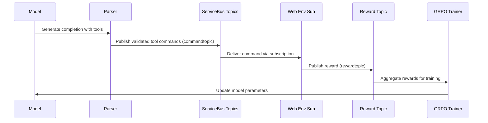

# GRPO Training Implementation 

Now as we have the basic infrastructure setup we will be implementing the following  - 

We will have the following mechanism 

1) For rewarding the model to have a correct tool call - If the model selects the correct tool we will have to reward the model (for now let's not implement it as this will be have to done on this machine itself using LLM as a judge)

2) Once the llm selects a tool like in this case the web tool, it will execute the command using the web tool. If it correctly executes the web env, (along with the format etc) it will get a reward from this web env too. 

3) This reward will be accumulated in a reward topic on this machine itself. Once we have the rewards for the entire task like 

reward_topic = [(web_env, 3), (code_env, 2), (infra/azure_env, 2)] then we will use another LLM as a judge for final env called task_env which will test whether the model has successfully completed the task and will assign a reward so the final reward topic will be [(web_env, 3), (code_env, 2), (infra/azure_env, 2), (task_reward, 2)] 

Remember the task topic will get the entire trajectory of the task and also will have the ability to generate novel test cases by itself. And then for now we will just add up these rewards, normalize them and send them back to the grpo algorithm 

4) Also for fun, for testing we will run one of the env from the enviornment hub on Prime Intellect to make the model perform better

## For now, we will just stick with the web tool/ env

Here’s the **reference for GRPO Trainer** with vLLM support from Hugging Face:

* **GRPO Trainer Documentation**: [https://huggingface.co/docs/trl/main/en/grpo\_trainer](https://huggingface.co/docs/trl/main/en/grpo_trainer)

### Minimal Example with vLLM (Single GPU)

```python
from datasets import load_dataset
from trl import GRPOConfig, GRPOTrainer

# Load dataset
dataset = load_dataset("trl-lib/tldr", split="train")

# Basic GRPO config with vLLM colocation
training_args = GRPOConfig(
    output_dir="grpo-vllm-demo",
    use_vllm=True,
    vllm_mode="colocate",            # run vLLM in the same process
    vllm_gpu_memory_utilization=0.3, # control GPU memory usage
    max_steps=100,
    num_generations=2,
    per_device_train_batch_size=2,
    logging_steps=5,
)

# Simple reward function placeholder (not used for now)
def reward_fn(completions, **kwargs):
    return [0 for _ in completions]

# Initialize trainer
trainer = GRPOTrainer(
    model="Qwen/Qwen2-0.5B-Instruct",  # example model
    train_dataset=dataset,
    reward_funcs=reward_fn,            # dummy reward function
    args=training_args,
)

# Train
trainer.train()
```

### Install dependencies:

```bash
pip install "trl[vllm]" datasets accelerate
```

This keeps things **very simple**: one A100 GPU, vLLM co-location, minimal dataset, and no complex reward logic yet.

---

If you want, I can give you a **list of all key GRPOConfig arguments** you’ll likely need for real experiments with vLLM. Would you like me to prepare that?

---

# GRPO Training Feature Documentation (Comprehensive Analysis)

## Changelog
- **2024-09-05-001**: Comprehensive documentation of current GRPO training implementation with reward mechanisms and tool orchestration.
- **2025-09-21-TopicMigration**: Migrated architecture descriptions from Azure Service Bus queues to topics + subscriptions (`get_topic_sender` / `get_subscription_receiver`). Classes renamed: `ServiceBusQueueWeb` -> `ServiceBusTopicWeb`; `ServiceBusQueueAzure` replaced by `ServiceBusTopicAzure`.

---

## A) Problem & Scope

**Users**: ML researchers training reasoning-focused LLMs to use external tools for complex task completion.

**Problem**: Training a Qwen-4B model with LoRA adapters to effectively orchestrate multiple containerized tools (web search, code execution, Azure CLI) using Group Relative Preference Optimization (GRPO) with reward signals from tool execution environments.

**Constraints**: 
- Single A100 GPU training environment
- Containerized tool execution with Azure Service Bus communication (topic/subscription model: `/home/ubuntu/GeneratorFS/serving/servicebus_web.py`, `/home/ubuntu/GeneratorFS/serving/servicebus_azure.py`)
- Real-time reward collection from multiple environments

**Non-goals**: Multi-GPU distributed training, non-containerized tool execution, other RL algorithms beyond GRPO.

---

## B) Requirements

**FR-001**: GRPO Training Pipeline
- **Acceptance Criteria**: Train Qwen-4B model using TRL GRPOTrainer with vLLM backend

**FR-002**: Multi-Tool Reward Collection (topics)
- **Acceptance Criteria**: Collect rewards from web, code, and azure environments via Service Bus topics (publish/subscribe)
- **Code Evidence**: `/home/ubuntu/GeneratorFS/serving/servicebus_web.py`, `/home/ubuntu/GeneratorFS/serving/servicebus_azure.py`

**FR-003**: Tool Call Parsing and Validation
- **Acceptance Criteria**: Parse `<web>`, `<code>`, `<azure>` XML tags and validate JSON schemas
- **Code Evidence**: `/home/ubuntu/GeneratorFS/serving/parser.py`

**FR-004**: Reward Aggregation
- **Acceptance Criteria**: Accumulate rewards as `[(web_env, score), (code_env, score), (azure_env, score), (task_reward, score)]`

**NFR-001**: Real-time Reward Processing
- **Acceptance Criteria**: Process rewards within 5-second intervals

---

## C) Current State

### Architecture Snapshot (Topic-Based)
```mermaid
graph TB
    A[Qwen-4B Model] --> B[Parser Module]
    B --> C{Tool Type}
    C -->|web| D[ServiceBusTopic (web)]
    C -->|azure| E[ServiceBusTopic (azure)] 
    C -->|code| F[Code Container]
    D --> G[Web Container Subscription]
    E --> H[Azure Container Subscription]
    G --> I[Reward Topic]
    H --> I
    F --> I
    I --> J[GRPO Trainer]
```

### API Inventory
- **Tool Execution**: `run_model.py:send_command()` - Routes tool calls to appropriate Service Bus topics
- **Web Rewards**: `ServiceBusTopicWeb.receive_web_reward_async()` (topic subscription)
- **Azure Rewards**: `ServiceBusTopicAzure.receive_messages_async()`

### Topic / Subscription Inventory
- **commandtopic** (subscription: `rlcommandbustopic`)
- **rewardtopic** (subscriptions: per tool consumer or aggregator)

### Configuration Usage
- **SERVICE_BUS_CONNECTION_STRING**: Azure Service Bus authentication
- **COMMAND_TOPIC_NAME / COMMAND_SUBSCRIPTION_NAME**: Command routing
- **REWARD_TOPIC_NAME**: Reward publication

### Known Tech Debt
- Reward normalization not implemented
- GRPO reward functions empty

---

## D) Proposed Design

### Reward Mechanism Flow (Publish/Subscribe)


---

## E) Implementation Plan
(unchanged except for topic terminology)

---

## F) Testing Strategy
- Update mocks to use `get_topic_sender` / `get_subscription_receiver`

---

## G) Operations
- Monitor dead-letter counts per subscription

---

## H) Traceability Matrix (Topic Adjusted)
| Requirement | Code Artifacts | Notes |
|-------------|---------------|-------|
| FR-002 | `servicebus_web.py`, `servicebus_azure.py` | Topic-based messaging |

---

## I) Repository Evidence Appendix (Updated)

### Symbol Index
- **ServiceBusTopicWeb**: Web topic management (sends via topic, receives via subscription)
- **ServiceBusTopicAzure**: Azure topic management  

### Topic Inventory
- commandtopic (publishes tool commands)
- rewardtopic (publishes tool results / rewards)

### Assumptions
- One reward subscription per trainer instance
